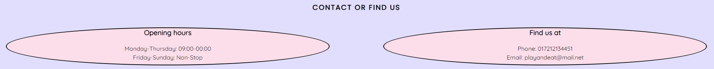

#  Play and Eat

Play and Eat is a site that hopes to bring alive the concept of Gaming Hall with a Restaurant combined. The target of the site will be those individuals who look for a nice place to eat with their friends and play some games in the same time. The site will be useful for the readers due to it's compact size, easy to find tools and interactive anchor elements.

## Features

### Existing Features 

- Navigation Bar
  - The element is present on all 3 pages of the site having a clickable logo with an interactive icon on hover, links to Home, Gallery Championship and Contact to be easier to navigate. The 4 elements are also animated with a font-size increase on hover and a background color to see where you are on the page
  - This tool will allow the user to navigate without using back and forward buttons of the web browser.
  - The Elements on hover animation will do great when it comes to identify where you are on the site and where you want to go.

- The main image
  - A very sugestive image that desscribes exactly the feeling you are going to have at the location with your friends
  - The text that suggests the "Motto" of the place and gives an idea of what is the site about
  
  
- The About Us Section
  - The about us section provides the Location name in the middle exactly like the main logo to have a simple but effective aproach
  - The 4 containers that provides with some information about the Location and what can you expect from it.
  - The icons which amplify the meaning of the text

  
- The Contact Section
  - The Contact Section features 3 elements to keep the format aswell simple. 
  - The 2 containers that have the Opening hours and the Phone number and email adress.
  - The map element that shows exactly where the location is via Google Maps

  
- The footer
  - The footer section is mainly strctured on 3 Social media links related to the page
  - The main aim for the footer is to make the reader to join the communities

  
- The photos page
  - This page provides with the most important pictures wich describes the most part of the features you have on the location
  - this page will be valuable for the user because he can see about anything that is or happens at the location

 
- The Championship page
  - This page will allow the user to register for the various tournaments that will have place on the location.

  
### Features left to implement

A Real time calendar for the events related with the Championship form. 
After you sign up to receive a discount code for your tab in the day of the event

## Testing

### Validator Testing

#### Html

No errors were found running the official  [W3C Validator](https://validator.w3.org/nu/?doc=https%3A%2F%2Fandreidrobota.github.io%2Fproject1%2F)

#### CSS

No errors were found running the official [Jigsaw Validator](https://jigsaw.w3.org/css-validator/validator?uri=https%3A%2F%2Fandreidrobota.github.io%2Fproject1%2F&profile=css3svg&usermedium=all&warning=1&vextwarning=&lang=en)

## Credits

### Content

The icons for the logo and footer from [Font Awesome](https://fontawesome.com/)

### Media

All the images are from the open source site [Pexels](https://www.pexels.com/)
